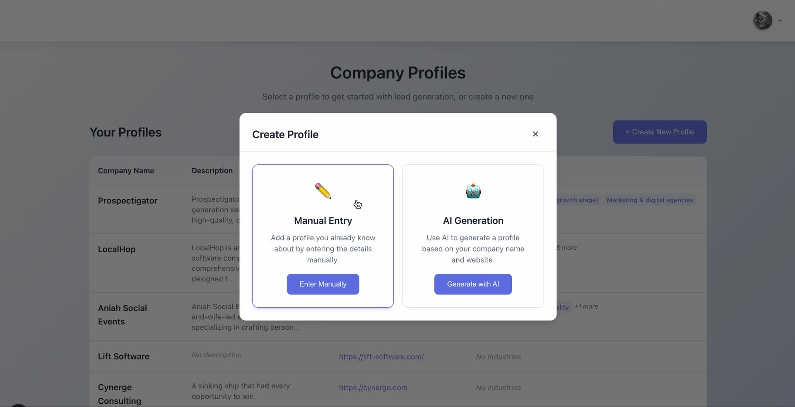
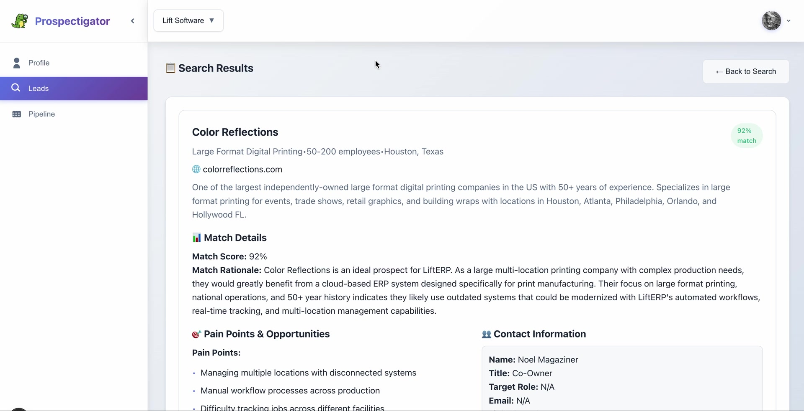
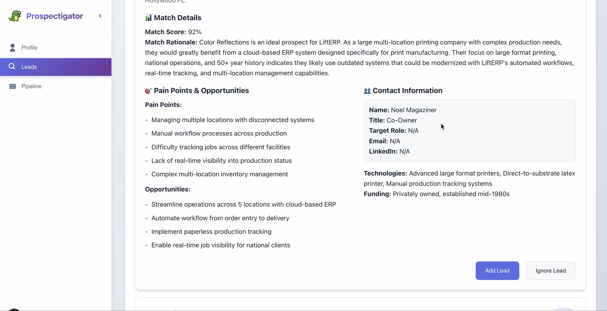
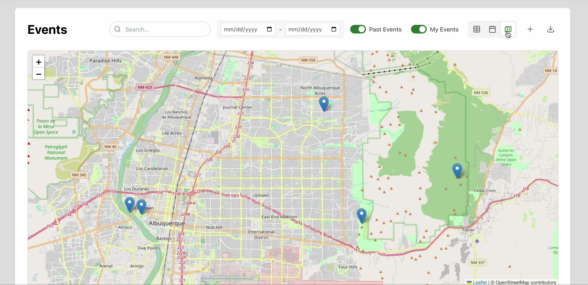
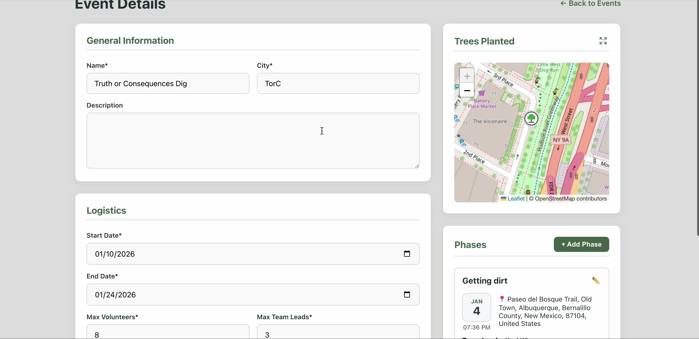
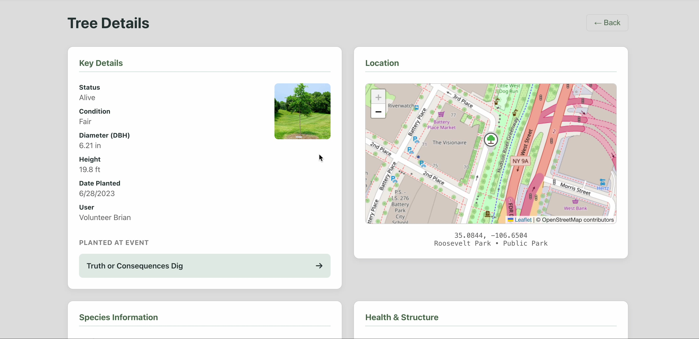

# Hey, I'm Brian 👋

Senior full-stack engineer based in Michigan with 10+ years of experience building and shipping production web and mobile applications. I specialize in modern frontend development — React, Vue, Svelte, React Native — but I'm comfortable across the whole stack, from Node.js APIs to AWS infrastructure.

Most of my professional work lives in private repos (government clients, enterprise contracts), but here's a bit about what I've been building.

---

## 🛠 What I Work With

**Frontend:** React, React Native, Vue, Angular, Svelte, Tailwind, D3.js, CSS/SCSS  
**Backend:** Node.js, AWS Lambda, Google Cloud Functions, REST APIs  
**Cloud:** AWS (Lambda, API Gateway, S3, CloudFormation, EC2), GCP, Docker, CircleCI  
**Databases:** Firebase/Firestore, DynamoDB, MongoDB, PostgreSQL, MySQL  
**Languages:** JavaScript (ES6+), TypeScript, Python  

---

## 🚀 Projects

### Prospectigator
An AI-powered lead generation tool that helps businesses find and qualify prospects. You describe your company and target market, and the app uses LLMs to surface matched leads with scored relevance, pain point analysis, competitive context, and contact information.

Built with: React, Node.js, Firebase, OpenAI API

---

### CanopyLog
A volunteer and event management platform built for environmental nonprofits running tree planting programs. Organizers can create planting events with phases, manage volunteer signups, and track individual trees — including location, species, health status, and photos — over time.

Built with: Svelte, Node.js, PostgreSQL, Leaflet.js

---

## 💼 Background

I've spent the last several years as a technical lead and senior engineer across a pretty wide range of domains:

- **Federal government** — served as primary engineer and sole technical decision-maker on [ePermits](https://epermits.fs2c.usda.gov/), a USDA Forest Service web application for purchasing national forest permits online. Led frontend development across 10+ government agency projects at Cynerge Consulting.
- **Cybersecurity SaaS** — built key UI features for [Tenable.io](https://www.tenable.com/), a large-scale enterprise vulnerability management platform used by security teams globally.
- **Consumer mobile** — led the React Native rewrite of the [BidFTA mobile auction app](https://play.google.com/store/apps/details?id=com.bidfta.mobile), a production app with hundreds of thousands of installs.
- **Referral marketing** — core frontend contributor on [Ambassador](https://getambassador.com/), an enterprise referral marketing SaaS platform.

---

## 🎓 A Slightly Unusual Background

I studied philosophy at Wayne State — specifically symbolic logic, formal logic, and philosophy of mind. It sounds like an odd path into software, but the way I think about system design, state, and edge cases probably owes more to that than I'd like to admit.

---

## Outside of Code

When I'm not staring at a screen I'm usually on my motorcycle, eating pizza, or hanging out with my family. Working on getting outside more. Michigan has more going for it than people give it credit for.

---

📫 **brian.davidson.1981@gmail.com** · [arc.dev profile](https://arc.dev/@briandavidson)
